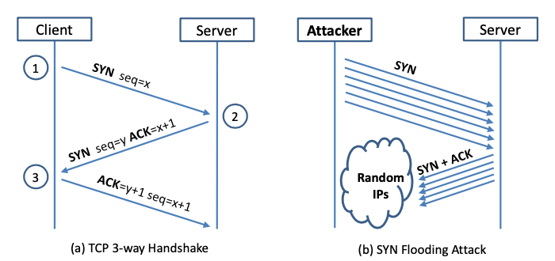

# SYN Flood

[](LICENSE)

SYN flood is a form of DoS attack in which attackers send many SYN requests to a victim’s TCP port, but the attackers have no intention to finish the 3-way handshake procedure.  

How does a SYN flood attack work?
SYN flood attacks work by exploiting the handshake process of a TCP connection. Under normal conditions, TCP exhibits three distinct processes in order to make a connection<sup id="r1">[(a)](#ab)</sup>.

1. The client requests a connection by sending a `SYN` (*synchronize*) packet to the server.
2. The server then responds with a `SYN-ACK` packet, in order to `ACK` (*acknowledge*) the communication.
3. The client sends an `ACK` packet to acknowledge the receipt of the packet from the server and the connection is established.

After completing this sequence of packet sending and receiving, the TCP connection is open and able to send and receive data. This is called the TCP three-way handshake. This technique is the foundation for every connection established using TCP.

To create a DoS, an attacker exploits the fact that after an initial `SYN` packet has been received, the server will respond back with one or more `SYN/ACK` packets and wait for the final step in the handshake. Cloudflare<sup id="r1">[[1]](#1)</sup> describes how it works<sup id="r1">[(b)](#ab)</sup>:

1. The attacker sends a high volume of `SYN` packets to the targeted server, often with spoofed IP addresses.
2. The server then responds to each one of the connection requests and leaves an open port ready to receive the response.
3. While the server waits for the final `ACK` packet, which never arrives, the attacker continues to send more `SYN` packets. The arrival of each new `SYN` packet causes the server to temporarily maintain a new open port connection for a certain length of time, and once all the available ports have been utilized the server is unable to function normally.

Attackers either use spoofed IP addresses or do not continue the procedure. Through this attack, attackers can flood the victim’s queue that is used for half-opened connections, i.e. the connections that has finished SYN, SYN-ACK, but has not yet gotten a final ACK back. When this queue is full, the victim cannot take any more connection.

<p align="center" id="ab">
    
</p>

## Network Setup

3 machines are needed. One computer is used as the **attacker**, the second computer is used as the **victim** (e.g., server), and the third computer is used as an **observer** (e.g., client). Set up 3 virtual machines on the same host computer, or set up 2 virtual machines, and then use the host computer as the third computer.

I assume that attackers are on the same physical network as the victims thus simplifying the task of determining TCP sequence numbers and source port numbers. Use sniffer tools to collect the necessary information.

## Attack

Use the `netwox` tool to conduct the attack, and then use a sniffer tool to capture the attacking packets. While the attack is going on, run the `netstat -na` command on the victim machine, and compare the result with that before the attack.

```bash
# check the size of the queue for holding half-open connections
sudo sysctl -q net.ipv4.tcp_max_syn_backlog

# check the current usage of the queue;
# i.e., the number of half-open connections associated with some listening port
netstat -na

# one netwox took that may be useful is tool number 76:
netwox 76 --help
```

**SYN Cookie Countermeasure:**
If it seems the attack is unsuccessful, investigate whether the **SYN cookie** mechanism is turned on. The SYN cookie is a defense mechanism to counter the SYN flooding attack. The mechanism will kick in if the machine detects that it is under the SYN flooding attack.

Use the `sysctl` command to turn on/off the SYN cookie mechanism:

```bash
sudo sysctl -a | grep cookie                 # Display the SYN cookie flag
sudo sysctl -w net.ipv4.tcp_syncookies=0     # turn off SYN cookie
sudo sysctl -w net.ipv4.tcp_syncookies=1     # turn on  SYN cookie
```

---

Thank you for your interest, this project was fun and insightful!

**Resources**

1.[^](#r1) <a href="https://www.cloudflare.com/learning/ddos/syn-flood-ddos-attack/" id="1">"SYN Flood Attack"</a> <i>Cloudflare</i>